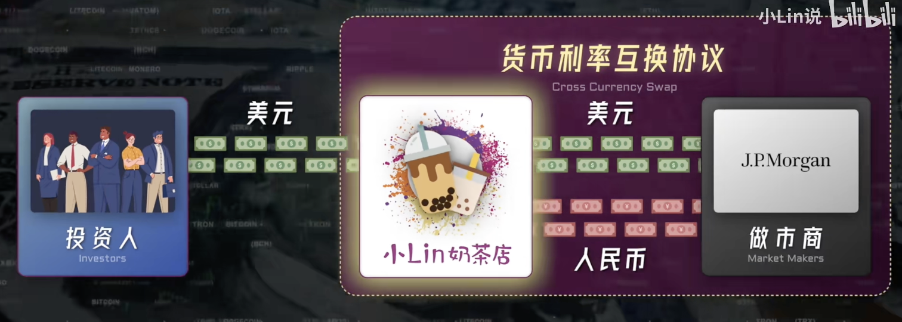

# Foreign Exchange Market — FX

```python
(1) Choose a financial markets reform proposal for China, and evaluate it.
(2) How would you change the PBOC, CSRC, CBIRC or other regulatory agencies? Why?
(3) Compare financial regulation with financial regulation in another area (US, HK). What are the relative strengths and weaknesses of each? How have they performed?
(4) How would you reform a financial regulation in China? Why?
(5) What reforms would you propose to make Chinese capital markets more efficient and safer?


# ---- Choose and evaluate ---- #
1. Find a foreign exchange market topic.
2. Evaluate it by data and find a result.

# ---- Compare with other countries' ---- #
1. Find the thing in other countries.
2. Do the comparition with other policy.
3. Find the strength and shortcoming for policies.

# ---- Make the reform ---- #
1. Framework is the financial regulation.
2. Detail is for the agencies.
3. Do some proposals.
```

## Basic Knowledge

> [**Vedio**](https://www.bilibili.com/video/BV1iW42197dP/?spm_id_from=333.337.search-card.all.click&vd_source=66823c3216b82637e31f708a5e627a0b)

### 交易量巨大

每天的外汇成交量高达 7.5 万亿美元，相当于美股和和 A 股最大加起来的 15 倍，是全球交易量最大的市场。人民币有两种，一种是在岸人民币 CNY 和一种离岸人民币 CNH。

外汇的参与者很多很杂，几乎覆盖到了市场中每一个参与者。

### 玩家

**中间商** — 做市商。外汇交易本质是去中间化的，没有一个集中交易的场所。但是各大投行和券商可能会做市，因此他们承担了大量的外汇交易额度。

监管相对比较松，索罗斯选择攻击外汇的重要因素（外汇市场可以被骂，但不会被杀）。很容易藏污纳垢，交易员只执行买单拉高价格。

外汇市场非常不透明，XTX market 和 Jump Trading 高频交易，通过量大来获取收益。

**抵消汇率风险**：通过外汇远期合约来对冲未来时间点的汇率风险（预估未来的现金流，尽量减少风险）

### 债务进行互换（掉期）操作

**进行货币利率互换交易**：将买美元的债变为买人民币的债。



构建互换的价格是十分复杂的。

### 从坐标维度上看外汇的含义

其实就是时间和价值维度上的坐标映射。

### 央行和政府


## Topic — 如何让人民币国际化


